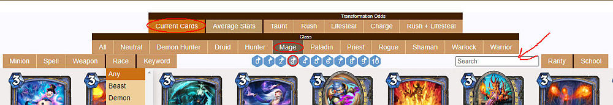
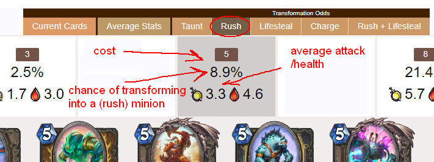
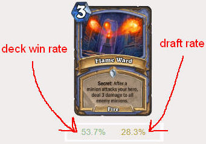
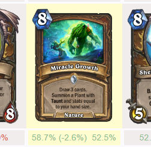

# HSArena Info
A desktop web app dedicated to Hearthstone Arena with helpful (and nerdy) info.

https://hs-arena-info.herokuapp.com/
 
## FEATURES
- Browse the current arena pool and quickly search for specific cards
- Card win and draft rates shows off which cards are doing well and which ones to play around
- Recently nerfed or buffed cards are marked and also have their win rate change displayed
- See helpful transform data (for example when evolving a minion)
  - Average minion attack/health for each mana pool
  - Chances of a minion having Taunt, Rush etc
  - List all possible minions to compare strengths for different mana pools

## USAGE
### Current Cards

>The default view (Current Cards button) shows the current arena cards. Click on a class and use the filters for more detailed results. Filters include card cost, type, race and so on. You can also search for specific card names or texts.

>Right-clicking on a class will enable Discover Mode, which includes neutral cards and displays their win/draft rates based on the selected class.
### Transformation Odds

>Transformation odds are helpful when needing immediate survival as it lists the best chances for getting Taunt, Rush etc when transforming a minion with a certain cost (for example with Evolve). It also lists the average attack/health with the chosen mechanic for each mana pool. Clicking on a mana pool will display all the possible minions. Average Stats includes every minion.
>- Banned minions are included when transforming
>- Dormant minions are excluded for mechanics since you usually want a minion that has immediate Rush etc

### Win/Draft Rates

>There's two numbers below each card, the first one is the deck win rate and the second number is the draft rate of the card. The draft rate in particular helps determine whether to play around a card, and which Secret is the most likely to be played. This data is taken from HSReplay.net and includes games from the last 14 days.

### Win Rate Tracking For Changed Cards

>Recently buffed or nerfed cards will have their win rate increase/decrease since their change tracked and displayed in parantheses. These changed cards will have a yellow background.

## PLANNED FEATURES
- Mark banned cards, add setting for hiding them
- Add discover odds
- Display current arena sets
- Add customized transformation odds
